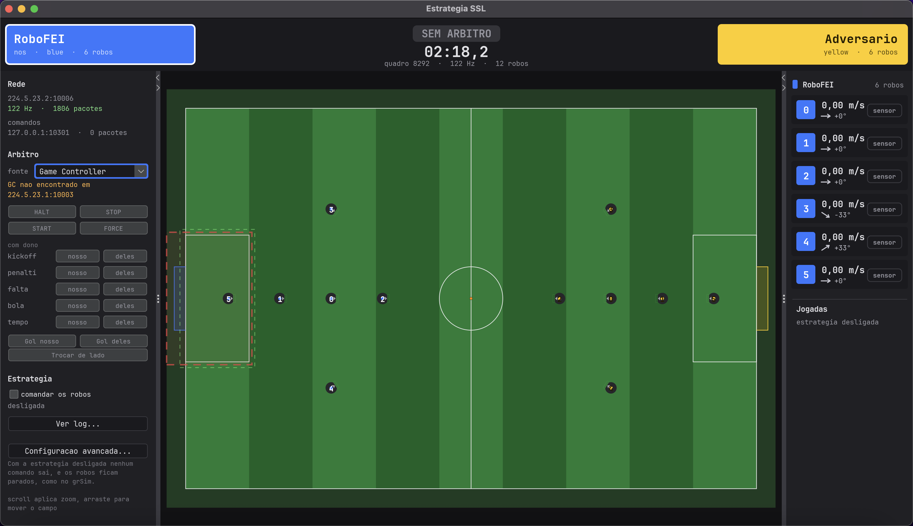
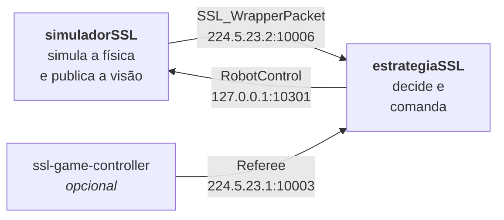
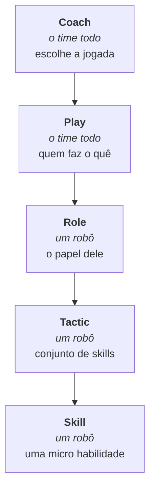
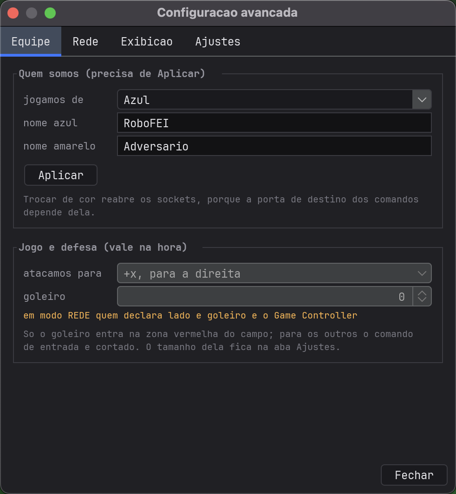

# Guia do estrategiaSSL

Este é o guia de **uso**. Ele ensina a rodar, a mexer e a resolver o que costuma dar errado.

Para saber **por que** cada decisão de projeto é o que é — por que o filtro é Kalman e não
passa-baixa, por que a área de defesa é cortada no `Executor` e não em cada play — o lugar é o
[README](README.md). Os dois textos têm leitores diferentes de propósito.

**Entre por onde faz sentido para você:**

| se você… | vá para |
|---|---|
| nunca rodou isso na vida | [Primeira vez](#primeira-vez) |
| quer entender o que é, sem instalar nada | [O que é isso](#o-que-é-isso) |
| vai escrever estratégia | [Sua primeira jogada](#sua-primeira-jogada) |
| já usa e quer só a referência | [Bancada](#bancada) |

---

## O que é isso

Este repositório é o **software de time** de uma equipe de futebol de robôs da categoria
[RoboCup SSL](https://ssl.robocup.org/): ele recebe onde os robôs estão, decide o que cada um
faz, e manda os comandos.



Ele **não enxerga sozinho**. Numa partida de verdade quem enxerga é a `ssl-vision`, com câmeras
no teto; na bancada quem faz esse papel é o [simuladorSSL](https://github.com/nThzzzz/simuladorSSL),
o repositório irmão. Os dois conversam só por UDP, pelo protocolo oficial da liga — nunca por
chamada de função:



### O detalhe que explica quase tudo

O protocolo da visão manda **muito pouco**: para cada robô, só `x`, `y`, `orientation` e a
confiança. Não manda velocidade, não manda quem está com a bola, não manda o comando que o robô
recebeu.

Então tudo que você vê na tela ou **veio da rede**, ou é **inferência nossa**:

| na tela | de onde vem |
|---|---|
| posição e ângulo do robô | rede (a visão mediu) |
| **velocidade** | inferida — filtro de Kalman, em `percepcao/` |
| **quem está com a bola** | inferida — geometria da boca, `SensorDeBola` |
| placar, faltas, lado do campo | rede (o Game Controller declarou) |

Essa separação é levada a sério no código e na interface: número inferido aparece marcado como
tal, porque tratar estimativa como medida é como se erra feio numa partida.

---

## Primeira vez

### O que você precisa

- **Java 22 ou mais novo** (`java -version` para conferir). Não precisa de Gradle nem de Maven.
- **Git**.

Nada mais. Os `.jar` que o projeto usa estão versionados em `lib/`, e o Java gerado dos `.proto`
está em `src/proto/` — um clone limpo compila **offline**.

### 1. Clone os dois repositórios, lado a lado

```bash
mkdir SSL && cd SSL
git clone https://github.com/nThzzzz/simuladorSSL.git
git clone https://github.com/nThzzzz/estrategiaSSL.git
```

> **Nunca ponha os dois no mesmo classpath.** Ambos têm `model.Geometria`, `model.Cor` e
> `rede.ConfigRede` com formatos diferentes — um descreve o mundo que *simula*, o outro o mundo
> que *observa*. São dois processos, sempre.

### 2. Compile

```bash
cd simuladorSSL   && ./tools/build.sh
cd ../estrategiaSSL && ./tools/build.sh
```

### 3. Suba o simulador

Num terminal:

```bash
cd simuladorSSL
java -cp "out/production/SSL:lib/*" Main
```

Abre uma janela com o campo e 6 robôs de cada lado. Eles ficam **parados**, e isso está certo:
sem um software de time conectado, ninguém está mandando comando — é assim que o grSim se
comporta também.

### 4. Suba a estratégia

Em **outro** terminal:

```bash
cd estrategiaSSL
java -cp "out/production/estrategiaSSL:lib/*" Main
```

### 5. Confira que a visão chegou

No painel da esquerda, em **Rede**, você deve ver a taxa em verde e o contador subindo:

```
224.5.23.2:10006
122 Hz  ·  1806 pacotes
```

E no topo, `12 robos`. Se aparecer `nada recebido ainda`, pule para
[Quando não chega nada](#quando-não-chega-nada).

Pronto — os dois programas estão conversando. O painel da direita mostra um cartão por robô
nosso, com a velocidade que o Kalman estimou e o estado do sensor de bola.

### 6. Ligue a estratégia

Marque **comandar os robos** no painel da esquerda. Enquanto isso está desligado nenhum comando
sai, que é o padrão seguro.

Não vai acontecer muita coisa ainda: o que existe hoje é o esqueleto e algumas jogadas de teste.
Fazer os robôs jogarem é justamente o que você vai escrever.

---

## Sua primeira jogada

A estratégia tem **cinco camadas**, no mesmo desenho do
[SSL-Strategy](https://gitlab.com/robofei/ssl/SSL-Strategy) da RoboFEI:



A regra para saber em que camada uma ideia mora:

> Se descrever a coisa exige um **"e depois"**, ela não é uma `Skill` — é uma `Tactic`.
>
> "andar até o ponto" é Skill. "pegar a bola **e depois** levar ao gol" é Tactic.

### Onde cada coisa fica

```
src/estrategia/
  esqueleto/   as 5 classes abstratas que você estende
  ids/         os enums — toda skill/tactic/role/play tem um id estável
  skills/      SkillAndarPara, SkillOlharPara, SkillChutar
  tactics/     TacticBuscarBola, TacticConduzirAoGol, ...
  roles/       RoleAtacante, RoleGoleiro
  plays/       PlayTesteAtacante
  coaches/     CoachBancada
```

O tipo vai no **nome**, e isso é de propósito: numa lista de arquivos ou numa pilha de exceção,
`AndarPara` sozinho não diz se é a skill que move o robô ou a tática que a usa — e as duas
existem.

### Escrevendo uma Skill

Uma `Skill` implementa três coisas. Dentro dela você tem `jogador` (o robô que a executa) e
`ambiente` (o mundo, já traduzido para "nós" e "eles"):

```java
package estrategia.skills;

import estrategia.esqueleto.Skill;

public final class SkillRecuar extends Skill {

    @Override public String strName() { return "Recuar"; }

    @Override public void vInitialize() { }   // roda uma vez, ao comecar

    @Override protected void vRun() {         // roda a cada tique
        if (!jogador.bEmCampo()) return;      // a visao pode ter perdido o robo

        jogador.vMover(-500, 0);              // 500 mm/s para tras DO ROBO

        if (ambiente.noNossoCampo(jogador.estado().posicao())) vFinalizar();
    }
}
```

Quatro coisas que essa dúzia de linhas já ensina:

- **`vMover` é no referencial local do robô** — frente e esquerda, não `+x` e `+y` do campo. Já
  `posicao()` é global. Confundir os dois é o erro mais comum aqui, e ele não dá exceção: o robô
  simplesmente anda para o lado errado quando está virado de outro jeito.
- **`vFinalizar()` é como a skill avisa que terminou.** Sem isso ela roda para sempre.
- **`bEmCampo()` antes de usar `estado()`**, porque a visão perde robô — oclusão acontece.
- **Unidades são mm, radianos e segundos**, sempre, como a SSL-Vision entrega. A conversão para
  os metros e graus que o simulador espera acontece só na borda, em `rede/`.

E duas que ela deliberadamente **não** faz:

- **Não confere `HALT` nem a área de defesa.** Isso é aplicado no `Executor`, no fim do tique,
  para todo mundo de uma vez. Se cada play tivesse de lembrar, bastaria uma esquecer para o time
  cometer falta — e é falta cara.
- **Não escreve o comando inteiro.** `vMover` mexe só no deslocamento; `vChutar` e `vDribbler`
  são separados de propósito, para uma cadeia de skills compor sem que a última apague o que as
  anteriores pediram.

> **Ids:** `Skill` não precisa de id. Quem se registra em `ids/` são as **Tactics** — veja
> `TacticBuscarBola`. Os ids existem para serem estáveis entre versões: um id que muda de valor
> estraga log antigo.

### Rodando sem abrir janela

`estrategia` não depende de `rede` nem de `view` — isso é verificado por teste, não é promessa.
Na prática: dá para rodar mil partidas de treino sem abrir janela nem tocar em socket.

```bash
java -cp "out/production/estrategiaSSL:lib/*" teste.AutotesteEstrategia
```

---

## Bancada

### Comandos

```bash
./tools/build.sh                                              # compila tudo

java -cp "out/production/estrategiaSSL:lib/*" Main            # joga de azul
java -cp "out/production/estrategiaSSL:lib/*" Main --amarelo  # joga de amarelo
java -cp "out/production/estrategiaSSL:lib/*" Main --ajuda    # todas as opções

java -cp "out/production/estrategiaSSL:lib/*" teste.Autoteste            # percepção, árbitro, protocolo, arquitetura
java -cp "out/production/estrategiaSSL:lib/*" teste.AutotesteEstrategia  # ciclo de vida das jogadas
```

Os testes não usam framework: são `main()` que imprimem `ok`/`FALHA` por verificação e saem com
código diferente de zero se algo quebrar.

### Endereços

| | endereço | mensagem |
|---|---|---|
| visão (entrada) | multicast `224.5.23.2:10006` | `SSL_WrapperPacket` |
| árbitro (entrada) | multicast `224.5.23.1:10003` | `Referee` |
| comandos (saída) | `127.0.0.1:10301` azul, `:10302` amarelo | `RobotControl` |

Trocar de cor **reabre os sockets**, porque a porta de destino depende dela.

### Configuração

Tudo é trocável com a janela aberta, em **Configuracao avancada…**:



| aba | o que fica lá |
|---|---|
| **Equipe** | de que cor jogamos, nomes, para que lado atacamos, quem é o goleiro |
| **Rede** | grupos multicast, portas, host do simulador |
| **Exibicao** | o que o campo desenha |
| **Ajustes** | as tolerâncias e tetos, sem recompilar — inclusive `TAXA_DA_TELA` |

`TAXA_DA_TELA` em zero — o padrão — pergunta ao monitor e usa a taxa dele: num monitor de 144 ou
165 Hz a janela deixa de ficar presa em 60. **Não muda a estratégia**: o `vDecidir` só age quando
chega quadro novo da visão, então desenhar mais vezes não deixa o time nem mais rápido nem mais
burro. Existe como ajuste porque 165 Hz gasta CPU, e num notebook na bateria isso pesa.

Os ajustes também podem vir de um `ajustes.json` na pasta de execução, carregado sozinho. A
carga **nunca é silenciosa**: o que mudou em relação ao padrão é impresso no terminal, porque um
valor diferente de fábrica sem nada dizendo vira caça ao fantasma.

### Na tela

| gesto | efeito |
|---|---|
| scroll | zoom, ancorado no cursor |
| arrastar | move o campo |
| clique num robô | seleciona (acende o cartão da direita, e vice-versa) |

---

## Quando não chega nada

### "nada recebido ainda", com o simulador rodando

**Os dois na mesma máquina?** Confira se o simulador não subiu com `--sem-rede` — assim ele não
publica nada, de propósito. No macOS, a primeira execução costuma pedir permissão de rede; se
foi negada, o multicast não sai.

**Em máquinas diferentes?** É o caso que mais dá trabalho, e tem receita.

O protocolo da liga é multicast, e multicast **frequentemente não atravessa** de uma máquina
para outra: a ponte do roteador entre Wi-Fi e cabo muitas vezes não repassa, e rede de faculdade
costuma bloquear por política. Não adianta insistir — a saída é mandar a visão **também por
unicast**, que sai como qualquer pacote UDP comum.

1. Aqui, em **Configuracao avancada → Rede**, leia o bloco *"Os IPs desta máquina"*. Anote o IP
   (algo como `192.168.15.8`).
2. No computador do simulador, em **Rede → Configurar…**, ponha esse IP no campo
   **Tambem enviar para**. Clique em *Aplicar*.
3. Ainda aqui, ponha o IP **do computador do simulador** em **Host do simulador** — senão a
   visão chega mas os comandos vão para `127.0.0.1` e os robôs não andam.

Isso não desliga o multicast: ele continua saindo, e quem estiver na mesma máquina continua
recebendo normalmente. O unicast é uma cópia a mais.

> Do lado de cá nada precisa mudar: o socket que escuta o grupo recebe unicast na mesma porta do
> mesmo jeito. Isso é verificado por teste, com sockets de verdade e sem ninguém entrar no grupo.

**Ainda nada?** No simulador, o campo **Interface de saída** deixa escolher por onde o multicast
sai. Vale tentar quando a máquina tem VPN, Docker ou VirtualBox: elas criam interfaces que
aceitam multicast e não levam a lugar nenhum, e o sistema às vezes escolhe justamente uma delas.
Prefira a que mostra um IP ao lado do nome.

> Deste lado, o ingresso no grupo é tentado em **todas** as interfaces que suportam multicast, e
> não só na padrão — esse pedaço já era tratado aqui. O que ficou para trás foi o lado que
> **envia**, e é o que a *Interface de saída* conserta.

### Chega visão, mas os robôs não andam

> **Os dois caminhos são independentes.** A visão vai do simulador para cá; os comandos vão daqui
> para o simulador. Acertar um **não** acerta o outro, e é o engano que mais custa tempo ao ligar
> duas máquinas: a tela enche de robô, tudo parece certo, e os comandos continuam indo para
> `127.0.0.1`, onde não há simulador nenhum.
>
> Quando isso acontece, o painel avisa em amarelo: *"a visão vem de 192.168.x — os comandos vão
> para outro lugar"*. Ponha esse IP em **Host do simulador**.

Se o aviso **não** aparece e mesmo assim nada anda, compare dois números:

| onde | o que olhar |
|---|---|
| aqui, painel Rede | `comandos … N pacotes` — quantos **saíram** |
| no simulador, painel Rede | `N comandos - N de robo` — quantos **chegaram** |

- **Sai 0**: o problema é daqui. Veja a lista abaixo.
- **Sai N, chega 0**: os pacotes estão se perdendo na rede. No Windows é quase sempre o
  firewall: ele libera **saída** e bloqueia **entrada** por padrão, e é exatamente por isso que a
  visão funciona (o PC envia) e os comandos não (o PC precisa receber). Procure em *Firewall do
  Windows → Permitir um aplicativo* por `java` ou `OpenJDK Platform binary`, e libere em redes
  privadas.
- **Sai N, chega N**: chegou. O problema é outro — siga para os itens abaixo.


1. **A caixa "comandar os robos" está marcada?** Desligada, nenhum comando sai.
2. **O árbitro está em `HALT`?** Em HALT nada se move, por regra. Sem Game Controller no ar, use
   os botões do painel da esquerda para simular um `START`.
3. **A cor está certa?** Comando de azul vai para a porta `10301`, de amarelo para a `10302`.
   Jogando de amarelo e mandando na porta do azul, o simulador ignora.

### "GC nao encontrado"

Normal, e não é erro: o `ssl-game-controller` é **opcional**. A janela funciona sem ele, e o
painel da esquerda permite simular comandos de árbitro localmente para testar.

### O lado do campo está trocado

Se o painel do árbitro disser **"lado nao declarado"** em amarelo, o Game Controller não está
mandando `blue_team_on_positive_half`, e o lado em uso é um chute — não um dado. Declare o lado
à mão em *Configuracao avancada → Equipe → atacamos para*.
